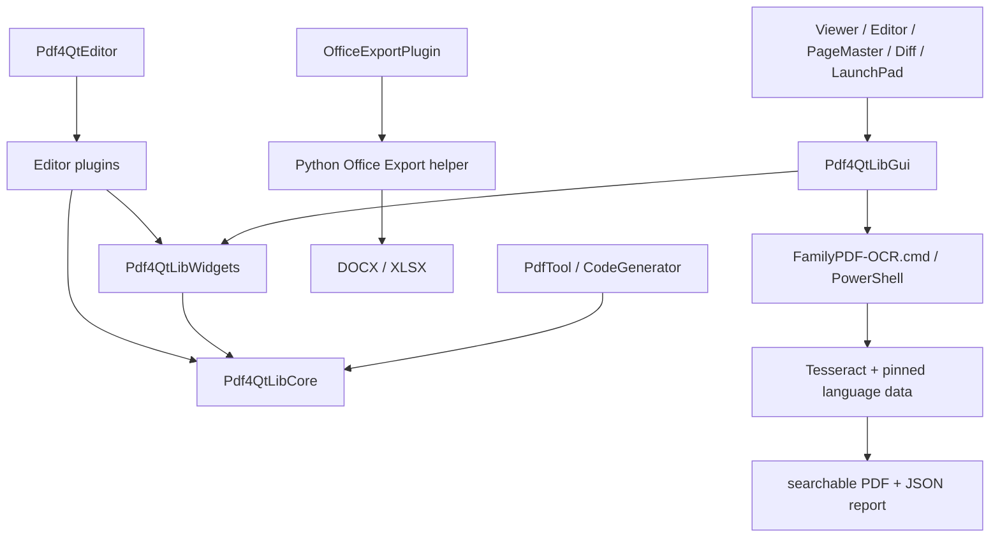

# FamilyPDF 工程接手審查

審查日期：2026-08-12

基準分支：`codex/phase0-baseline`

基準提交：`8e99f67d0259ce04d5436fb40d7f93e99588af47`

## 結論

FamilyPDF 是 PDF4QT 的產品化分支，不是單一 PDF Viewer。主體為 C++20、Qt 6 與 CMake，包含 PDF 核心解析／渲染函式庫、共用 Widgets、Viewer、Editor、PageMaster、Diff、命令列工具與動態外掛；FamilyPDF 另外加入安全儲存、復原／工作階段、表單與文件編輯、Office 匯出、OCR、Windows 安裝及 QA 自動化。

目前受 Git 控制的檔案共 1,260 個，其中 226 個 `.cpp`、231 個 `.h`、48 個 `.ui`、36 個 PowerShell 與 14 個 Python 檔。審查涵蓋全部受控檔案清單、建置與套件設定、所有可執行入口、模組 CMake 關係、測試與 CI，以及高風險的檔案寫入、外部程序、下載與安裝路徑；對核心資料流進行逐檔人工追蹤。

本輪已修正資料遺失與供應鏈風險、合入相關上游缺陷修補，且本機與 GitHub Windows／Ubuntu 均通過。沒有發現仍未處理的阻斷級或高風險已知缺陷；仍有測試覆蓋、版本 metadata、工作流程重複與大型類別等中低優先技術債。

## 架構

### 模組責任

| 模組 | 責任 | 主要依賴 |
|---|---|---|
| `Pdf4QtLibCore` | PDF object model、parser、writer、字型、色彩、影像、簽章、安全、渲染、內容編輯 | Qt Core/Gui/Svg/Xml、OpenSSL、zlib、FreeType、OpenJPEG、JPEG、PNG、Blend2D、LCMS、TBB |
| `Pdf4QtLibWidgets` | PDF 檢視器、註解、內容編輯工具與共用 Qt Widgets | Core、Qt Widgets/PrintSupport/Concurrent |
| `Pdf4QtLibGui` | Viewer/Editor controller、主視窗、設定、書籤、工作階段、復原、安全儲存、TTS | Core、Widgets、Qt TextToSpeech |
| `Pdf4QtEditorPlugins` | 編輯、表單、文件編輯、簽章、遮蔽、掃描、Office 匯出等可選功能 | Core、Widgets；簽章另用 OpenSSL；掃描依平台使用 WIA/SANE |
| 應用程式 | Viewer、Editor、PageMaster、Diff、LaunchPad、PdfTool | 上述函式庫與外掛 |
| `office-export` | 搜尋文字／表格／影像擷取，輸出 DOCX/XLSX | Python、pdfplumber、pypdf、python-docx、openpyxl |
| `scripts/ocr` | OCR 語言選擇、Tesseract 執行、PDF 合併、報告與安裝包 | PowerShell、Tesseract、PdfTool、固定雜湊語言模型 |

## 入口

- GUI：`Pdf4QtViewer/main.cpp`、`Pdf4QtEditor/main.cpp`、`Pdf4QtPageMaster/main.cpp`、`Pdf4QtDiff/main.cpp`、`Pdf4QtLaunchPad/main.cpp`。
- CLI／開發工具：`PdfTool/main.cpp`、`CodeGenerator/main.cpp`、`PdfExampleGenerator/main.cpp`、`JBIG2_Viewer/main.cpp`。
- Office helper：`office-export/entrypoint.py` → `familypdf_office_export.cli.main()`。
- OCR：安裝後由 `FamilyPDF-OCR.cmd` 進入 `scripts/ocr/FamilyPDF-OCR.ps1`。
- 建置：根 `CMakeLists.txt`；Windows 可重現建置入口為 `scripts/phase0/build-upstream-baseline.ps1`。

## 主要資料流

### 開啟與顯示 PDF

1. Viewer／Editor main 建立 Qt application、translator 與主視窗。
2. `PDFProgramController` 讀取檔案，Core parser 建立 `PDFDocument` object graph。
3. Widgets 將頁面請求交給 Core renderer；色彩、字型、影像與透明度管線產生畫面。
4. GUI 保存目前文件、頁面、工具狀態與最近檔案；多視窗路徑由 session manager 聚合。

### 編輯與安全儲存

1. 編輯器或外掛透過 document builder／manipulator 產生新 document state。
2. writer 先輸出同目錄 candidate，而非直接覆寫原檔。
3. `PDFSafeSaveService` 驗證 candidate、來源 baseline（大小、時間、SHA-256；Windows 另驗證 volume/file identity）與儲存媒體。
4. 建立 `.FamilyPDFBackup` 後，以 Windows `ReplaceFileW` 或 POSIX `rename` 原子提交，再重新驗證結果。
5. 編輯後延遲五秒啟動非同步 recovery snapshot；重複請求以 pending flag 合併。啟動時只提供開啟復原副本或丟棄，不直接覆寫原檔。

### Office 匯出

1. C++ plugin 以 `QProcess` 傳遞分離的參數，不經 shell。
2. Python helper 驗證輸入、輸出及頁碼，使用 pdfplumber 擷取文字、表格與頁面影像。
3. layout heuristic 推斷一至三欄並建立 DOCX/XLSX。
4. helper 在目的目錄建立 candidate，完成後以 `os.replace` 原子替換；stdout 回傳 JSON 給 GUI。
5. 無搜尋文字層時回傳 `needs_ocr`，不默默產生空白文件。

### OCR

1. GUI 要求已儲存的來源與不同的輸出路徑，再啟動已安裝 launcher。
2. PowerShell 驗證工具與固定語言 manifest，渲染頁面後呼叫 Tesseract。
3. 產生每頁 OCR PDF／文字，合併為搜尋型 PDF，並產生信心與人工複核 JSON 報告。
4. 發佈採 staging、備份與 cleanup，下載測試驗證 SHA-256 不符時拒絕安裝。

## 設定與依賴

- C++ language：C++20；CMake 最低 3.16；Qt 6.9.1 為目前驗證版本。
- C++ 套件：`vcpkg.json`；基準 commit 固定為 `6d9d7df564a1ccdaa994e4ad39ccd4a32360867b`。
- Python direct dependencies：`office-export/requirements.in`；完整 transitive lock 與 hashes 位於 `requirements.lock`。
- 產品版本：`VERSION` = 0.2.2；OCR 版本：`OCR_VERSION` = 0.4.2；上游 PDF4QT ABI／應用版本由 CMake 設為 1.6.0.0。
- 應用設定：Qt settings path；FamilyPDF session/recovery 資料集中由 `PDFFamilyPDFPaths` 決定。
- 包裝：Inno Setup、WiX/MSI、AppImage、Flatpak 與 Debian package 各有獨立入口。
- CI：`ci.yml` 負責 Windows／Ubuntu C++ build、CTest 與 artifacts；`familypdf-validation.yml` 負責 PowerShell、OCR metadata、Python tests 與 Ruff。

## 本輪已修正

### 高優先級

1. **Office 匯出可能破壞既有輸出**：改為目的目錄 candidate + `os.replace`；拒絕輸入輸出為同一檔案，新增兩項回歸測試。
2. **非 Windows 安全儲存存在 delete-then-rename 空窗**：改用 POSIX `rename` 原子替換，並修正平台路徑大小寫比較。
3. **GitHub Actions 與 vcpkg 供應鏈浮動**：Action 全部固定 SHA；CI、Linux AppImage 與 Windows MSI 的 vcpkg 固定到同一已驗證 commit，cache key 同步包含 commit。
4. **Python 已知漏洞**：更新 pypdf、pytest、cryptography 並重建 hash lock；`pip-audit` 結果為零個已知漏洞。
5. **內容編輯圖片消失**：合入上游 issue #238 修補與必要前置修補，加入 `UnitTestsContentEditor` 回歸測試。
6. **Text-to-Speech 無聲音**：合入上游 issue #397 修補。

### 驗證期間事件

最初增量建置的 ContentEditor 測試崩潰，完全乾淨建置後 7/7 通過，證明是舊 object／ABI 快取污染。另一次因前一個建置命令逾時後子程序尚未退出，兩個 Ninja 同時寫入相同 `.obj` 而得到 permission denied；清除重疊程序並以單一乾淨建置重跑後通過。兩者均未以刪除測試或降低標準處理。

## 仍存在的問題與技術債

### P1：近期應處理

1. **GitHub 安全功能未啟用**：repository API 顯示 Dependabot alerts 未啟用，CodeQL 也沒有分析結果。現有 lock、hash 與 `pip-audit` 不能取代持續的 C++／workflow 掃描。建議啟用 Dependabot alerts、dependency graph 與 CodeQL；此項涉及 repository settings，未在程式碼審查中擅自改動。
2. **發佈 workflow 缺少常態回歸**：`LinuxInstall.yml` 與 `WindowsInstall.yml` 僅手動執行，且主要驗證集中在 `ci.yml`。正式 release 前仍應執行這兩條並驗證簽章／安裝器；不能由一般 CI 綠燈推論簽章 secrets 與 installer runner 一定有效。

### P2：中期技術債

1. **測試覆蓋不均**：Core 有 7 個 CTest executable，但 GUI controller、安全儲存、recovery、scanner、OCR GUI launcher 與 installer 的核心分支主要靠 PowerShell smoke／人工互動。建議下一輪優先補 safe-save platform tests 與 Office plugin process/JSON integration test。
2. **版本 metadata 漂移**：CMake 為 PDF4QT 1.6.0.0，而 `vcpkg.json` 與 `vcpkg_with_qt.json` 仍標 1.5.2。這不影響目前 manifest dependency resolution，但會誤導 SBOM、cache 與套件追蹤；應與上游一起統一，不要把 FamilyPDF 0.2.2 混入上游 library version。
3. **大型 controller／window 類別**：`PDFProgramController` 與 PageMaster `MainWindow` 同時負責 UI action、I/O、外部工具與狀態協調，修改半徑大。不要全面重寫；新增功能時逐步把純 I/O 或可測策略留在既有 service 層。
4. **建置腳本路徑重複**：本機工具根、Qt/vcpkg 解析與 package cleanup 分散在多個 PowerShell workflow。現有 phase0 腳本可重現，但文件仍含歷史路徑。只應在下一次工具鏈升級時集中單一已存在的解析入口，避免現在做無功能價值的大重構。
5. **測試 CMake 重複**：七個測試 target 的 link/property/add_test boilerplate 幾乎相同。可用小型 CMake function 消除，但目前只有七組且穩定，優先級低於測試內容本身。

### P3：已知限制／效能

1. Office 欄位判斷採固定比例 heuristic；複雜報刊、跨欄標題、旋轉文字與重疊物件可能排序不準。已有多欄測試，但不是完整排版引擎。
2. Office 影像以 144 DPI 渲染整頁後裁切；大量高解析圖片會增加記憶體與 CPU。需要有真實大型文件基準後，再考慮逐物件解碼或可調 DPI。
3. Safe-save baseline 每次計算完整 SHA-256；大型 PDF 儲存前後會有線性 I/O 成本。這是避免外部修改與資料遺失的刻意取捨，不應在沒有 profiling 前移除。
4. Recovery 會序列化完整文件，但已非同步執行並合併 pending 請求。若大型文件仍造成磁碟壓力，再以量測決定是否採增量或延長間隔。
5. 既有 CI 顯示 GitHub 正將部分 Node.js 20 Action 強制跑在 Node.js 24 相容模式。Action 已固定 SHA，安全性較佳；官方發布相容 major 後應更新 SHA 並重新驗證。

## 重複與未使用程式碼結論

- 明確重複集中於測試 CMake、各平台 package workflow 與 Viewer／Editor 啟動樣板；它們反映不同 target／平台，現在合併的收益低於造成 release 回歸的風險。
- 全庫僅找到一個 TODO/FIXME 類標記，沒有堆積式未完成區塊。
- Release 以 MSVC `/W4`、C++20 建置成功；Python Ruff 通過。未發現可安全刪除且與目前需求相關的高優先未使用程式碼。
- C++ 動態 plugin、Qt meta-object、resources 與平台條件編譯會讓單純文字引用掃描產生誤判；在沒有 clang-tidy/cppcheck 與各平台 link-time dead-code report 的情況下，不以「搜尋不到呼叫」為由刪除現有程式碼。

## 驗證證據

| Gate | 結果 |
|---|---|
| 本機乾淨 Windows Release build | 成功 |
| CTest | 7/7 通過，含 ContentEditor 回歸 |
| Python pytest | 13/13 通過 |
| Ruff | 通過 |
| PowerShell 5.1 全檔 parse | 通過 |
| OCR manifest／下載 hash／release metadata | 通過 |
| pip-audit | 0 個已知漏洞 |
| GitHub FamilyPDF validation | 成功，run 31606954547 |
| GitHub CI Ubuntu | 成功 |
| GitHub CI Windows | 成功；完整 run 31606954546 |

## 接手建議順序

1. 保持 `ci.yml` 與 `familypdf-validation.yml` 為每次 push 的必要 gate。
2. 在 repository settings 啟用 Dependabot／CodeQL，先觀察結果再處理，不批次盲升依賴。
3. release 前手動跑 Windows MSI 與 Linux AppImage workflow，驗證簽章與實際安裝／移除。
4. 下一輪程式工作優先補 safe-save 與 plugin process integration tests，再處理版本 metadata。
5. 大型 controller 與 workflow 重複只做需求驅動的小步抽離，不做全庫翻修。
